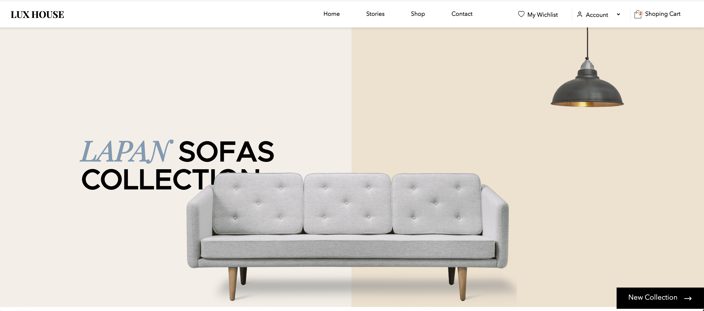

# Lux House eCommerce Platform

> eCommerce platform built with the MERN stack & Redux.
> Design inspired by Ivan Sipilov (Online E-commerce furniture store in Miami)



## Features

- Full featured shopping cart
- Product search feature
- User profile with orders
- Admin product management
- Admin user management
- Admin Order details page
- Mark orders as delivered option
- Checkout process (shipping, payment method, etc)
- PayPal / credit card integration
- Database seeder (products & users)


### Env Variables

Create a .env file in then frontend and backend separately and add the following

```
On Backend

NODE_ENV = developement
PORT = 5000
MONGO_URI = your mongoDB URI

TOKEN_SECRET= your JWT Token
TOKEN_EXPIRE=7d
REDIS_PASS=your redis cloud pass

STRIPE_SECRET_KEY= your stripe secret key

PAYPAL_CLIENT_ID= your paypal client ID


WEB_APP_URL= your domain name
CLOUDINARY_NAME= your cloudinary name
CLOUDINARY_API_KEY= 
CLOUDINARY_API_SECRET= 

```


```
On Frontend

REACT_APP_MAPBOX_TOKEN= your Mapbox token


REACT_APP_STATE_TOKEN=

REACT_APP_GET_TOKEN=your token to get country state list

REACT_APP_PUBLISHABLE_KEY= Your Stripe publishable key
```

### Install Dependencies (frontend & backend)

```
npm install
cd frontend
npm install
```

### Run

```
# Run frontend (:3000) & backend (:5000)
npm run dev

# Run backend only
npm run server
```

## Build & Deploy

```
# Create frontend prod build
cd frontend
npm run build
```
 The backend is hosted in Heroku ad frontend on Netlify

### Seed Database

You can use the following commands to seed the database with some sample users and products as well as destroy all data

```
# Import data
npm run data:import

# Destroy data
npm run data:destroy
```

```
Sample User Logins

admin@example.com (Admin)
123456

john@example.com (Customer)
123456

jane@example.com (Customer)
123456
```

## License

The MIT License

Copyright (c) 2021 Abderaouf yettou 

Permission is hereby granted, free of charge, to any person obtaining a copy
of this software and associated documentation files (the "Software"), to deal
in the Software without restriction, including without limitation the rights
to use, copy, modify, merge, publish, distribute, sublicense, and/or sell
copies of the Software, and to permit persons to whom the Software is
furnished to do so, subject to the following conditions:

The above copyright notice and this permission notice shall be included in
all copies or substantial portions of the Software.

THE SOFTWARE IS PROVIDED "AS IS", WITHOUT WARRANTY OF ANY KIND, EXPRESS OR
IMPLIED, INCLUDING BUT NOT LIMITED TO THE WARRANTIES OF MERCHANTABILITY,
FITNESS FOR A PARTICULAR PURPOSE AND NONINFRINGEMENT. IN NO EVENT SHALL THE
AUTHORS OR COPYRIGHT HOLDERS BE LIABLE FOR ANY CLAIM, DAMAGES OR OTHER
LIABILITY, WHETHER IN AN ACTION OF CONTRACT, TORT OR OTHERWISE, ARISING FROM,
OUT OF OR IN CONNECTION WITH THE SOFTWARE OR THE USE OR OTHER DEALINGS IN
THE SOFTWARE.
